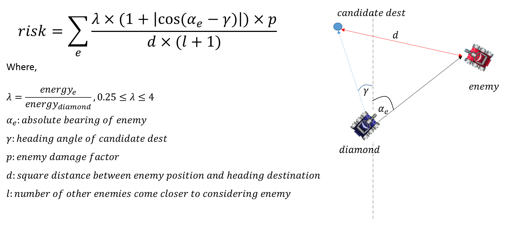

# Diamond

## Movement
### [Strategy](http://robowiki.net/wiki/Diamond):
1. Melee Mode 
  * Stay far away from other bots
  * Stay perpendicular to other bots
  * Don't be the closest bot to any other bots (to avoid being targeted)
  * Weight risks by energy and bullet damage factors
  * Some randomizing based on past locations
  * Referrence:
    * [Melee Movement](http://robowiki.net/wiki/Movement)
    * [Anti-Gravity Movement](http://robowiki.net/wiki/Anti-Gravity_Movement)
    * [Minimum Risk Movement](http://robowiki.net/wiki/Minimum_Risk_Movement)
2. 1v1 Mode
  * Predicts where he would intersect the enemy wave if he orbits clockwise, counter-clockwise, or slams on the brakes. Calculate the danger for this position based on where we've detected enemy bullets
  * For each predicted spot on the first wave, branch from that position and predict clockwise/counter-clockwise/stop on the second wave. Take the lowest danger
  * Weight the wave dangers by time to impact and bullet power
  * Multiply in a distancing factor
  * Choose the safest of the 3 movement options

### Let's go to detail
```
voidious
├── move
│   ├── DiamondWhoosh.java
│   ├── MeleeMover.java
│   ├── SurfMover.java
│   ├── MoveDataManagement.java
|   └── MoveEnemy.java
├── Diamond.java
```
#### Diamond.java ([Source](https://github.com/Voidious/Diamond/blob/master/voidious/Diamond.java))
Declare the main object of move
```
protected static DiamondWhoosh _move;
```
For each turn, the "move" action will be triggered first, then "fire", then "scan". **Question: What if we change the order?**
```
public void run() {
    try {
      ...
      while (true) {
        _gfx.updatePaintProcessing();
        if (!_TC) {
          _move.execute();
        }
        if (!_MC) {
          _gun.execute();
        }
        _radar.execute();
        execute();
      }
    } catch (RuntimeException re) {
      logAndRethrowException(re);
    }
  }
```
Diamond also have some mechanism of movement when Enemy Robot is scanned, Enemy Robot is Death or Diamond is hit by bullet...
```
public void onScannedRobot(ScannedRobotEvent e) {
    _move.onScannedRobot(e);
}
public void onRobotDeath(ScannedRobotEvent e) {
    _move.onRobotDeath(e);
}
public void onHitByBullet(ScannedRobotEvent e) {
    _move.onHitByBullet(e);
}
```
#### DiamondWhoosh.java ([Source](https://github.com/Voidious/Diamond/blob/master/voidious/move/DiamondWhoosh.java))
Is the main movement class of Diamond. Technically, all the action for each turn, or some event happen is divided into 2 mode: **Melee Mode** and **1v1 Mode**

For each turn,
```
private void move() {
    if (is1v1()) {
      _surfMover.move(_moveDataManager.myStateLog().getState(_robot.getTime()),
          _moveDataManager.duelEnemy(), WAVES_TO_SURF, paintStatus());
    } else {
      _meleeMover.move(myLocation(), _moveDataManager.getAllEnemyData(),
          _moveDataManager.getClosestLivingBot(myLocation()), paintStatus());
    }
  }
```
When Enemy Robot is scanned, it simply update the information of Enemy Bot into `_moveDataManager`
```
public void onScannedRobot(ScannedRobotEvent e) {
    Point2D.Double myLocation = myLocation();
    String botName = e.getName();
    double absBearing = Utils.normalAbsoluteAngle(
        e.getBearingRadians() + _robot.getHeadingRadians());
    Point2D.Double enemyLocation =
        DiaUtils.project(myLocation, absBearing, e.getDistance());

    double previousEnemyEnergy;
    if (_moveDataManager.hasEnemy(botName)) {
      previousEnemyEnergy = _moveDataManager.getEnemyData(botName).energy;
      _moveDataManager.updateEnemy(
          e, enemyLocation, absBearing, _robot.getRoundNum(), is1v1());
    } else {
      previousEnemyEnergy = e.getEnergy();
      _moveDataManager.newEnemy(
          e, enemyLocation, absBearing, _robot.getRoundNum(), is1v1());
    }

    if (is1v1() && _moveDataManager.duelEnemy() != null) {
      _moveDataManager.updateEnemyWaves(myLocation(), previousEnemyEnergy,
          botName, _robot.getRoundNum(), _robot.getTime(), _robot.getEnergy(),
          _robot.getHeadingRadians(), _robot.getVelocity(), WAVES_TO_SURF);
    }
  }
```
When other even occur, the `_moveDataManager` also is updated

#### MeleeMover.java ([Source](https://github.com/Voidious/Diamond/blob/master/voidious/move/MeleeMover.java))
Generate some candidate positions where it can move
```
List<Destination> destinations = generateDestinations(myLocation, enemies, closestEnemy);
```
And choose the best `destination` among `destinations` with the lowest risk without hitting wall
```
Destination nextDestination = getNextDestination(myLocation, destinations);
...
private Destination getNextDestination(Point2D.Double myLocation, List<Destination> destinations) {
    Destination nextDestination;
    RobotState currentState = RobotState.newBuilder()
        .setLocation(myLocation)
        .setHeading(_robot.getHeadingRadians())
        .setVelocity(_robot.getVelocity())
        .setTime(_robot.getTime())
        .build();
    do {
      nextDestination = safestDestination(myLocation, destinations);
      destinations.remove(nextDestination);
    } while (wouldHitWall(currentState, nextDestination));
    return nextDestination;
}
private Destination safestDestination(
      Point2D.Double myLocation, List<Destination> possibleDestinations) {
    double lowestRisk = Double.POSITIVE_INFINITY;
    Destination safest = null;

    for (Destination destination : possibleDestinations) {
      if (destination.risk < lowestRisk) {
        lowestRisk = destination.risk;
        safest = destination;
      }
}
```
How to generate candidate `destinations`
* Generate all the `possibleDestinations` around its position
```
possibleDestinations.addAll(generatePointsAroundBot(myLocation, enemies, closestEnemy));
```
* Calculate the current heading position. If the distance of heading position <= the closest enemy position, then also add that point as a candidate
```
if (myLocation.distance(_currentDestination.location) <= myLocation.distance(closestEnemy.lastScanState.location)) {
      double currentGoAngle = DiaUtils.absoluteBearing(myLocation, _currentDestination.location);
      double currentRisk = CURRENT_DESTINATION_BIAS * evaluateRisk(enemies, _currentDestination.location, _currentDestination.goAngle);
      _currentDestination = new Destination(_currentDestination.location, currentRisk, currentGoAngle);
      possibleDestinations.add(_currentDestination);
    }
```
How to select the `possibleDestinations` around Diamond position
* Draw a circlie with a radius which is the minimum of random number or distance of closest enemy
* Sampling `NUM_SLICES_BOT` (64) points on that circle
* Calculate `dest`, `risk`, `angle` for each point
```
    double distanceToClosestBot =myLocation.distance(closestEnemy.lastScanState.location);
    double movementStick = Math.min(100 + Math.random() * 100, distanceToClosestBot);

    double sliceSize = (2 * Math.PI) / NUM_SLICES_BOT;
    for (int x = 0; x < NUM_SLICES_BOT; x++) {
      double angle = x * sliceSize;
      Point2D.Double dest = _battleField.translateToField(DiaUtils.project(myLocation, angle, movementStick));
      destinations.add(new Destination(dest, evaluateRisk(enemies, dest, angle), angle));
    }
```
How to `evaluateRisk`


```
    double risk = 0;
    for (MoveEnemy moveData : enemies) {
      if (moveData.alive) {
        double distanceSq =
            destination.distanceSq(moveData.lastScanState.location);
        risk += DiaUtils.limit(0.25, moveData.energy / _robot.getEnergy(), 4)
            * (1 + Math.abs(Math.cos(moveData.absBearing - goAngle)))
            * moveData.damageFactor
            / (distanceSq * (moveData.botsCloser(distanceSq * .8) + 1)
            );
      }
```
#### SurfMover.java ([Source](https://github.com/Voidious/Diamond/blob/master/voidious/move/SurfMover.java))
At very first momment of each turn, Diamond will check `FIRST_WAVE` still have a chance to hit it or not. If yes, it will make a move in `surf` mode, otherwise, `orbit` mode
```
    Wave surfWave = duelEnemy.findSurfableWave(Wave.FIRST_WAVE, myRobotState);

    if (surfWave == null) {
      orbit(myLocation, duelEnemy);
    } else {
      surf(myRobotState, duelEnemy, surfWave, wavesToSurf, painting);
    }
```
In `orbit` mode, Diamond will calculate `retreateAngle` which is a safe angle help it keep the same distance with the enemy. Then it will use `retreateAngle` factor to calculate `counterGoAngle` and `clockwiseGoAngle` which is good angle in case it wants to move in counter clockwise and clockwise direction. And then choose the angle that have to turn less than other to be the next move
```
void orbit(Point2D.Double myLocation, MoveEnemy duelEnemy) {
    _robot.setMaxVelocity(8);
    RobotState enemyState = duelEnemy.lastScanState;
    double orbitAbsBearing = DiaUtils.absoluteBearing(enemyState.location, myLocation);
    double retreatAngle = _distancer.orbitAttackAngle(myLocation.distance(enemyState.location));
    double counterGoAngle = orbitAbsBearing + (SurfOption.COUNTER_CLOCKWISE.getDirection() * ((Math.PI / 2) + retreatAngle));
    counterGoAngle = wallSmoothing(myLocation, counterGoAngle, SurfOption.COUNTER_CLOCKWISE);

    double clockwiseGoAngle = orbitAbsBearing + (SurfOption.CLOCKWISE.getDirection() * ((Math.PI / 2) + retreatAngle));
    clockwiseGoAngle = wallSmoothing(myLocation, clockwiseGoAngle, SurfOption.CLOCKWISE);

    double goAngle;
    if (Math.abs(Utils.normalRelativeAngle(clockwiseGoAngle - orbitAbsBearing))
        < Math.abs(Utils.normalRelativeAngle(counterGoAngle - orbitAbsBearing))) {
      _lastSurfOption = SurfOption.CLOCKWISE;
      goAngle = clockwiseGoAngle;
    } else {
      _lastSurfOption = SurfOption.COUNTER_CLOCKWISE;
      goAngle = counterGoAngle;
    }

    DiaUtils.setBackAsFront(_robot, goAngle);
}
```
In `surf` mode,
```
void surf(RobotState myRobotState, MoveEnemy duelEnemy, Wave surfWave,
      int wavesToSurf, boolean painting) {
    if (surfWave != _lastWaveSurfed) {
      duelEnemy.clearNeighborCache();
      _lastWaveSurfed = surfWave;
      _lastSurfDestination = null;
      _stopDestination = null;
    }

    boolean goingClockwise = (_lastSurfOption == SurfOption.CLOCKWISE);
    updateSurfDangers(myRobotState, duelEnemy, wavesToSurf, goingClockwise);
    double counterDanger = _surfOptionDangers.get(SurfOption.COUNTER_CLOCKWISE);
    double stopDanger = _surfOptionDangers.get(SurfOption.STOP);
    double clockwiseDanger = _surfOptionDangers.get(SurfOption.CLOCKWISE);

    Point2D.Double surfDestination;
    if (stopDanger <= counterDanger && stopDanger <= clockwiseDanger) {
      if (_stopDestination == null) {
        _stopDestination = _surfOptionDestinations.get(_lastSurfOption);
      }
      surfDestination = _stopDestination;
      _robot.setMaxVelocity(0);
      _lastSurfDestination = null;
    } else {
      _robot.setMaxVelocity(8);
      _lastSurfOption = (clockwiseDanger < counterDanger)
          ? SurfOption.CLOCKWISE : SurfOption.COUNTER_CLOCKWISE;
      surfDestination = _surfOptionDestinations.get(_lastSurfOption);
      _lastSurfDestination = surfDestination;
      _stopDestination = null;
    }

    double goAngle =
        DiaUtils.absoluteBearing(myRobotState.location, surfDestination);
    goAngle = wallSmoothing(myRobotState.location, goAngle, _lastSurfOption);

    if (painting) {
      duelEnemy.drawRawWaves(_robot.getTime());
      for (int x = 0; x < WAVES_TO_DRAW; x++) {
        drawWaveDangers(myRobotState, duelEnemy, x);
        drawWaveShadows(myRobotState, duelEnemy, x);
      }
    }

    DiaUtils.setBackAsFront(_robot, goAngle);
}
```